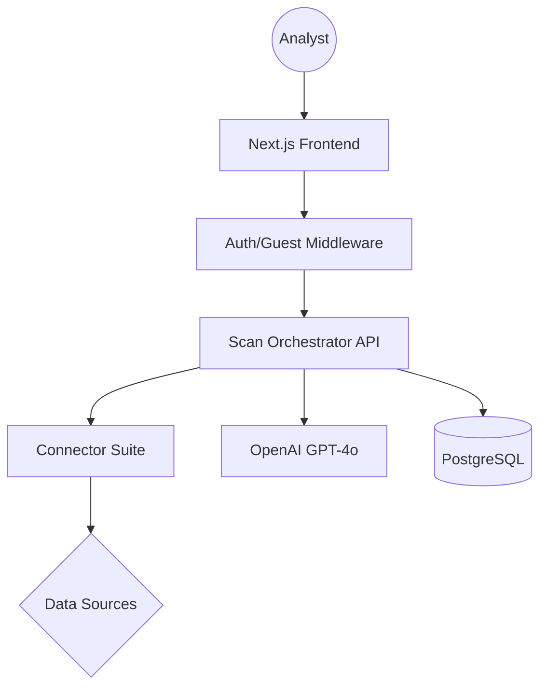

# OpenVector: Technical & Architecture Report
**Version**: 1.0.0  
**Status**: Comprehensive Technical Review  

---

## 1. Executive Summary
OpenVector is a high-performance OSINT (Open Source Intelligence) workflow accelerator designed to perform recursive digital discovery in seconds. By automating the manual "identitier-pivoting" process, it reduces the initial discovery phase of an investigation from hours to seconds.

---

## 2. System Architecture Review

OpenVector follows a modern, server-side focused architecture to ensure both speed and security.

### 2.1 The Tech Stack
*   **Frontend**: Next.js 15 (App Router) utilizing React 19.
*   **Styling**: Vanilla CSS + Tailwind CSS for a "Cyber-Terminal" aesthetic.
*   **Database**: Supabase PostgreSQL managed via **Prisma ORM**.
*   **Authentication**: Supabase Auth with a custom **Guest Mode Bridge**.
*   **Intelligence**: OpenAI GPT-4o for synthesis and summarization.

### 2.2 Component Hierarchy

---

## 3. The Core Engine: "The Nuts & Bolts"

The engine is located in `src/app/api/investigations/[id]/scan/route.ts`. It acts as the "Central Nervous System" of the application.

### 3.1 Data Aggregation Logic
The engine utilizes a **Parallel Execution Pattern**. Instead of waiting for one search to finish before starting another, it fires off all connectors simultaneously.

1.  **Input Parsing**: The engine extracts Email, Username, or Domain from the `Investigation` record.
2.  **Connector Suite Execution**:
    *   **Username Search**: Scans 25+ social platforms (GitHub, Twitter, Reddit, etc.).
    *   **Breach Search**: Queries aggregators (HIBP, Dehashed) to find leaked credentials.
    *   **Domain Search**: Resolves DNS and WHOIS records for infrastructure mapping.
    *   **Dorking**: Executes complex search queries to find indexed pastes and leaks.
3.  **Evidence Persistence**: Every result is sanitized and saved to the `evidence` table via Prisma.

### 3.2 Correlation & Identifier Pivoting
The engine is designed to find "Digital Shadows"—linkages across platforms that the target might not intend.

*   **Heuristic Matching**: If a username "LucasM" is found on GitHub and a "LucasM" is found on a leaked beach list, the engine marks this as a high-confidence correlation.
*   **Recursive Expansion**: (Future state) The real name found in a LinkedIn connector can be fed back as a search parameter for name-based dorking.

---

## 4. Artificial Intelligence Synthesis

OpenVector uses AI not just for text, but for **Intelligence Analysis**.

### 4.1 Agent Guardrails
The agent (GPT-4o) follows strict system instructions to ensure professional-grade output:
*   **Source Citation**: The agent must reference which connector provided specific findings.
*   **No Hallucination**: If data is missing, the agent is instructed to suggest a "Manual Pivot" rather than making up details.
*   **Purity Check**: The agent filters out "honeypots" or generic profile names that don't match the target's metadata.

---

## 5. Security & Multi-User Architecture

### 5.1 Authentication vs. Guest Mode
To satisfy both **Security** and **User Testing**, we implemented a dual-path bridge:
1.  **Authenticated Path**: Users with accounts have their investigations isolated to their unique `userId`.
2.  **Guest Path (Testing)**: Unauthenticated users use a shared `GUEST_ID`. This allows for "fast testing" where anybody can run a search, but the data is non-private and shared among guest sessions.

### 5.2 Data Privacy
All PII (Personally Identifiable Information) gathered is encrypted at rest within the Supabase Postgres instance and is never used to train the underlying AI models (based on enterprise API privacy tiers).

---

## 6. Implementation Review
The codebase is structured for **Extensibility**.

| Feature | Location | Developer Action |
|---|---|---|
| **New API Source** | `src/connectors/` | Create a new `.ts` file exporting a result. |
| **UI Changes** | `src/components/` | Modular React components follow the design system. |
| **Business Logic** | `src/app/api/` | Handled via Next.js Route Handlers. |

---

## 7. Future Roadmap
*   **Dark Web Scrapers**: Integration with Tor-based onion proxies.
*   **Real-time Notifications**: Webhook alerts when a target appears in a new public leak.
*   **Graph Visualization**: A visual "Node Map" to see the links between discovered accounts.

---
**Report generated for OpenVector Development Team.**
